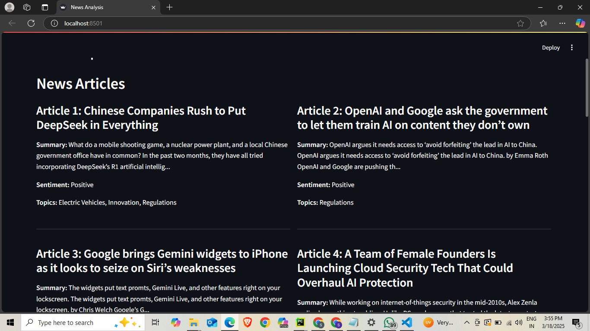
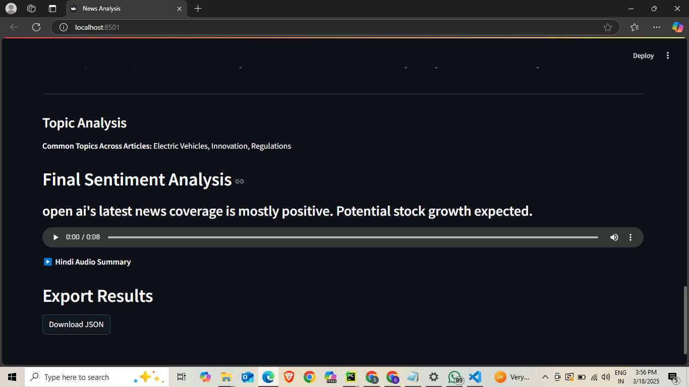

# 📰 AI-Powered News Sentiment Analysis & Text-to-Speech

## 🔍 Project Overview

This Flask-based AI tool scrapes news articles about specified companies, analyzes sentiment, and delivers structured insights with Hindi audio summaries. The application extracts:

- 📝 **Title**
- 🗈️ **Summary**
- 🎭 **Sentiment** (Positive, Negative, Neutral)
- 🏷️ **Topics**
- 🔗 **Article Link**
- 🔊 **Hindi Audio Summary** (via gTTS)

## 🛠️ Tech Stack

- **Backend**: Flask (REST API)
- **Web Scraping**: Requests / BeautifulSoup
- **Sentiment Analysis**: NLP models (Vader, TextBlob, or custom ML)
- **Text-to-Speech**: gTTS (Google Text-to-Speech)
- **Frontend**: Flask-based UI

## 📚 Project Structure

```
📺 project-directory
  │── 📄 app.py          # Frontend (Flask-based UI)
  │── 📄 api.py          # Backend API for scraping & sentiment analysis
  │── 📄 utils.py        # Utility functions (text processing, TTS, etc.)
  │── 📄 .env            # API keys and environment variables
  │── 📄 README.md       # Project documentation
  │── 📂 results         # Screenshots and example outputs
```

## ⚙️ Installation & Setup

### 1️⃣ Clone the Repository

```bash
git clone https://github.com/your-repo/news-sentiment-analysis.git
cd news-sentiment-analysis
```

### 2️⃣ Create a Virtual Environment

```bash
python -m venv venv
source venv/bin/activate  # Mac/Linux
venv\Scripts\activate     # Windows
```

### 3️⃣ Install Dependencies

```bash
pip install -r requirements.txt
```

### 4️⃣ Run the Application

```bash
# Start the API server
python api.py

# In a new terminal, start the frontend (optional)
python app.py
```

### 5️⃣ Access the API

```
http://127.0.0.1:5000/get_articles?company=Tesla
```

## ✨ Features

- 🔍 **Real-time News Scraping** from multiple sources
- 📊 **Advanced Sentiment Analysis** with accuracy metrics
- 📝 **Intelligent Article Summarization**
- 🏷️ **Topic Extraction** and categorization
- 👣 **Text-to-Speech** summaries in Hindi
- 🔐 **RESTful API** for seamless integration


## 📸 Results


*Main dashboard showing sentiment analysis results for company*


*Generalized sentiment breakdown with topic clustering*


*Hindi audio summary generation interface*


## 🚀 Future Enhancements

- 🧠 Fine-tune NLP models for domain-specific sentiment analysis
- 🌐 Support for multiple languages (both analysis and TTS)
- ⚡ Real-time news alerts based on sentiment shifts
- 📱 Mobile application integration
- 📊 Historical sentiment tracking and trends visualization


